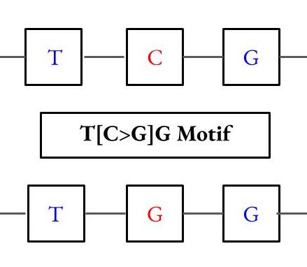

==============================
What are motifs?
==============================

A motif is a characteristic pattern of DNA change, often associated with a carcinogen or a biological process. 
A motif's pattern includes a characteristic DNA context and a single-base substitution. 

----------------------------------------
How does MutaGene represent motifs?
----------------------------------------

MutaGene represents motifs in a string of characters, where the characters not in brackets represent the unmutated DNA context,
and the characters in brackets represent the single-base substitution.

Examples
---------- 

"A[C>A]G" represents the DNA sequence "ACG" mutated into the DNA sequence "AAG"

"C[G>T]" represents the DNA sequence "CG" mutated into the DNA sequence "CT"

"[C>A]C" represents the DNA sequence "CC" mutated into the DNA sequence "AC"

Motif Visualization
--------------------

--------------------------------------------------
Where can I read more about motifs?
--------------------------------------------------

This `publication <http://www.ncbi.nlm.nih.gov/pubmed/28498882/>`_ describes motifs and their uses 

==============================
Motif Subpackage Documentation
==============================
